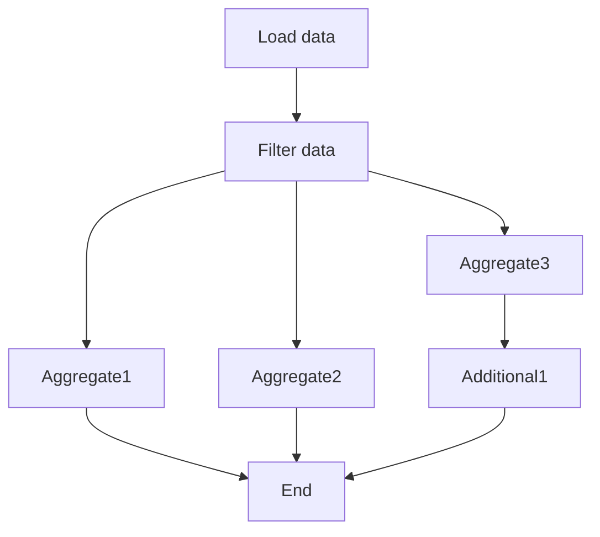

# asyncqu

[](https://coveralls.io/github/goforbroke1006/asyncqu)

Library for asynchronous task execution.

# Definitions

* **Stage** - tasks (bunch of commands) that should be run sequentially or in parallel along with another stage;
* **State** - condition of stage (Runnable, Running, Done);
* **Clauses** - list of stages that should be done before run current stage;
* **Executor** - running mechanism what keeps stages order;

# How to use

Add module to project:

```shell
go get github.com/goforbroke1006/asyncqu@latest
```

Create executor and stages:

```go
executor := asyncqu.New()
executor.Append("stage1", /* some callback */, asyncqu.Start) // <-- asyncqu.Start special clause marker for initial stages
executor.Append("stage2", /* some callback */, "stage1") // <-- wait for stage1
executor.Append("stage31", /* some callback */, "stage2") // <-- run in parallel after stage2
executor.Append("stage32", /* some callback */, "stage2") // <-- run in parallel after stage2

_ = executor.AsyncRun(context.Background())
_ = executor.Wait()

fmt.Printf("finished with errors: %v\n", executor.Errs())
```

### Full sample

Let's say you have tasks that take long time.

And a couple of tasks can be executed in same time.



* At first, you need load data (from DB for example);
* And filter rows with ignore list maybe;
* aggregation stages 1, 2, 3 can be run in parallel;
* additional-1 stage can be run only after aggregation #3
* if aggregation stages 1, 2 and stage additional-1 finished that execution is done!

How to describe stages:

```go
package main

import (
	"context"
	"fmt"
	"os"
	"time"

	"github.com/goforbroke1006/asyncqu"
)

func main() {
	executor := asyncqu.New()

	const (
		stage1LoadData    = asyncqu.StageName("stage-1-load-data")
		stage2FilterData  = asyncqu.StageName("stage-2-filter-data")
		stage3Aggregate1  = asyncqu.StageName("stage-3-aggregate-1")
		stage3Aggregate2  = asyncqu.StageName("stage-3-aggregate-2")
		stage3Aggregate3  = asyncqu.StageName("stage-3-aggregate-3")
		stage4Additional1 = asyncqu.StageName("stage-4-additional-1")
	)

	executor.SetOnChanges(func(stageName asyncqu.StageName, state asyncqu.State, err error) {
		fmt.Printf("step %s in status %s with %v error\n", stageName, state, err)
	})

	executor.Append(stage1LoadData, func(ctx context.Context) error {
		time.Sleep(time.Second)
		return nil
	}, asyncqu.Start)

	executor.Append(stage2FilterData, func(ctx context.Context) error {
		time.Sleep(time.Second)
		return nil
	}, stage1LoadData)

	executor.Append(stage3Aggregate1, func(ctx context.Context) error {
		time.Sleep(time.Second)
		return nil
	}, stage2FilterData)
	executor.Append(stage3Aggregate2, func(ctx context.Context) error {
		time.Sleep(time.Second)
		return nil
	}, stage2FilterData)
	executor.Append(stage3Aggregate3, func(ctx context.Context) error {
		time.Sleep(time.Second)
		return nil
	}, stage2FilterData)

	executor.Append(stage4Additional1, func(ctx context.Context) error {
		time.Sleep(time.Second)
		return nil
	}, stage3Aggregate3)

	executor.SetEnd(stage3Aggregate1, stage3Aggregate2, stage4Additional1)

	if runErr := executor.AsyncRun(context.Background()); runErr != nil {
		fmt.Printf("ERROR: %s\n", runErr.Error())
		os.Exit(1)
	}

	_ = executor.Wait()

	if execErrs := executor.Errs(); len(execErrs) > 0 {
		for _, err := range execErrs {
			fmt.Printf("ERROR: %s\n", err.Error())
		}
	}
}

```
